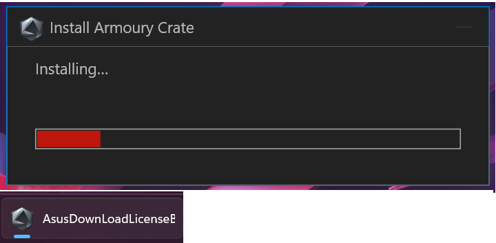

# LeRobot SO-101 Installation Guide (Windows 11 + WSL2)

A tested walkthrough for setting up the Hugging Face LeRobot stack for the SO-101 arm on Windows 11 using WSL2 Ubuntu.

The official [LeRobot installation docs](https://huggingface.co/docs/lerobot/installation) target Linux and macOS. This guide fills in the Windows-specific pieces: WSL2 setup, USB passthrough for the Feetech bus servo adapter, and the small gotchas that break the install if you follow the Linux instructions verbatim.

> **Status:** In progress. I'm documenting each step as I complete it on my own machine. Currently through Step 1. More steps will be added as I verify them end-to-end.

## Why WSL2 instead of native Windows

LeRobot, the Feetech SDK, and most of the robotics ecosystem assume a Unix-style environment with `/dev/ttyACM0` or `/dev/ttyUSB0` device paths. Running on WSL2 keeps you aligned with the official docs and community examples, and avoids driver-passthrough headaches down the line.

## Prerequisites

- Windows 11 with virtualization enabled in BIOS
- Admin access on your Windows account
- The SO-101 bus servo adapter (Feetech / Waveshare) connected via USB

## Step 1: Install WSL2 with Ubuntu 24.04

Open PowerShell as Administrator:

```powershell
wsl --install -d Ubuntu-24.04
```

Reboot when prompted. On first launch, Ubuntu asks you to create a Unix username and password (separate from your Windows login).

Verify you're on WSL2:

```powershell
wsl -l -v
```

You want `VERSION 2`. If it shows 1, run `wsl --set-version Ubuntu-24.04 2`.

> **Heads up (ASUS motherboards):** If `wsl --install` hangs or the required reboot loops, Armoury Crate may be stuck. See [WSL install hangs on ASUS motherboards](#wsl-install-hangs-on-asus-motherboards) in Common issues.


Screenshot placeholder: successful `wsl -l -v` output showing VERSION 2
<!--

-->


## Common issues

### WSL install hangs on ASUS motherboards

**Symptom**
`wsl --install` hangs, or the required reboot loops without completing. Task Manager may show Armoury Crate stuck.

**Cause**
Armoury Crate installation blocks the WSL install cycle on some ASUS boards.

**Fix**
1. Open Windows Settings → Windows Update → Advanced options → Optional updates
2. Install any pending ASUS system updates
3. Reboot
4. Re-run `wsl --install -d Ubuntu-24.04`


Screenshot placeholder: Windows Optional updates screen with ASUS updates listed
<!--

-->


**References**
- [r/ASUS: Armoury Crate installation stuck](https://www.reddit.com/r/ASUS/comments/jqb9ud/solved_armoury_crate_installation_stuck_at/)

---

## Work in progress

Upcoming sections, added as I verify each on my machine:

- [ ] Step 2: Move to your Linux home directory
- [ ] Step 3: Update Ubuntu and install build basics
- [ ] Step 4: Enable the universe repo and install ffmpeg
- [ ] Step 5: Install Miniforge
- [ ] Step 6: Create the LeRobot conda environment
- [ ] Step 7: Clone and install LeRobot with Feetech support
- [ ] Step 8: Install evdev (WSL-specific)
- [ ] Step 9: Set up USB passthrough with usbipd-win
- [ ] Step 10: Add yourself to the dialout group
- [ ] Step 11: Verify the install

---

If this guide helped or you hit an issue not listed here, open an issue or reach out.
